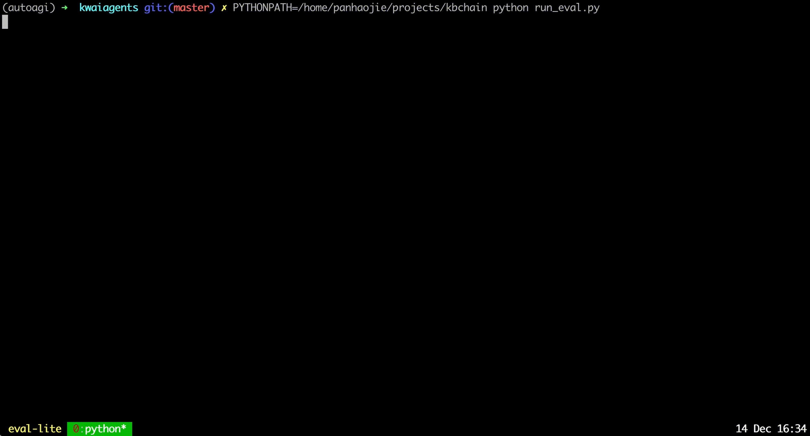

<p align="left">
    <a href="README.md">English</a> ｜ <a href="README_ZH.md">中文</a> | 日本語
</p>
<br><br>

<p align="center">
    
<p>
<br>

<p align="center">
      📚 <a href="https://huggingface.co/datasets/kwaikeg/KAgentInstruct">データセット</a> | 📚 <a href="https://huggingface.co/datasets/kwaikeg/KAgentBench">ベンチマーク</a> | 🤗 <a href="https://huggingface.co/collections/kwaikeg/kagentlms-6551e685b5ec9f9a077d42ef">モデル</a> | 📑 <a href="http://arxiv.org/abs/2312.04889">論文</a>
<br>

KwaiAgents は、[Kuaishou Technology](https://www.kuaishou.com/en) の [KwaiKEG](https://github.com/KwaiKEG) によってオープンソース化されたエージェント関連の作品シリーズです。オープンソース化されたコンテンツには以下が含まれます:

1. **KAgentSys-Lite**: KAgentSys-Lite は、KAgentSys のライトバージョンである。KAgentSys-Lite は、元のシステムの機能の一部を保持していますが、フル機能の対応物と比較すると、以下のような特定の相違点と制限があります: (1)より限定されたツールセット、(2)メモリメカニズムの欠如、(3)若干低下したパフォーマンス能力、(4)BabyAGI や Auto-GPT のようなオープンソースプロジェクトから進化した異なるコードベース。これらの変更にもかかわらず、KAgentSys-Lite は、利用可能な数多くのオープンソースエージェントシステムの中で同等のパフォーマンスを提供します。
2. **KAgentLMs**: この論文で提案されているメタエージェント・チューニングによって獲得された、プランニング、リフレクション、ツール使用などのエージェント能力を持つ一連の大規模言語モデル。
3. **KAgentInstruct**: 論文で提案された200k以上のエージェント関連命令の微調整データ（部分的に人間が編集したもの）。
4. **KAgentBench**: Agent の能力をテストするための、3,000を超える人間による自動化された評価データ。評価項目には、計画、ツールの使用、考察、結論、プロファイリングが含まれる。

<table align='center'>
    <tr>
        <td align='center'><b>タイプ</b></td>
        <td align='center'><b>モデル</b></td>
        <td align='center'><b>訓練データ</b></td>
        <td align='center'><b>ベンチマークデータ</b></td>
    </tr>
    <tr>
        <td>Qwen</td>
        <td>
            <a href="https://huggingface.co/kwaikeg/kagentlms_qwen_7b_mat">Qwen-7B-MAT</a> <br> 
            <a href="https://huggingface.co/kwaikeg/kagentlms_qwen_14b_mat">Qwen-14B-MAT</a> <br>
            <a href="https://huggingface.co/kwaikeg/kagentlms_qwen_7b_mat_gguf">Qwen-7B-MAT-cpp</a> <br>
            <a href="https://huggingface.co/kwaikeg/kagentlms_qwen1.5_14b_mat">Qwen1.5-14B-MAT</a>
        </td>
        <td align="center" rowspan="2"><a href="https://huggingface.co/datasets/kwaikeg/KAgentInstruct">KAgentInstruct</a></td>
        <td align="center" rowspan="2"><a href="https://huggingface.co/datasets/kwaikeg/KAgentBench">KAgentBench</a></td>
    </tr>
    <tr>
        <td>Baichuan</td>
        <td><a href="https://huggingface.co/kwaikeg/kagentlms_baichuan2_13b_mat">Baichuan2-13B-MAT</a></td>
    </tr>
</table>


<br>

<p align="center">
    
<p>

<br>

<p align="center">
    
<p>

## ニュース
* 2024年4月19日 - Qwen1.5-14B-MATモデル [[リンク]](https://huggingface.co/kwaikeg/kagentlms_qwen1.5_14b_mat) がリリースされました。
* 2024年4月9日 - ベンチマーク結果が更新されました。
* 2024.1.29 - Qwen-14B-MAT [[リンク]](https://huggingface.co/kwaikeg/kagentlms_qwen_14b_mat) をリリース.
* 2023.1.5 - トレーニングデータ[[リンク]](https://huggingface.co/datasets/kwaikeg/KAgentInstruct)をリリース。
* 2023.12.27 - 🔥🔥🔥 KwaiAgents　は多くのサイトで報告されている。[[机器之心]](https://mp.weixin.qq.com/s/QhZIFL1GHH90z98gnk194g) [[Medium]](https://medium.com/@myscarletpan/can-7b-models-now-master-ai-agents-a-look-at-kwais-recent-llm-open-source-release-8b9e84647412) [[InfoQ]](https://www.infoq.cn/article/xHGJwG3b8hXSdaP4m6r0) など。
* 2023.12.13 - 公開されたベンチマークと評価コード[[リンク]](https://huggingface.co/datasets/kwaikeg/KAgentBench)をリリース
* 2023.12.08 - テクニカルレポート[[リンク]](https://arxiv.org/abs/2312.04889)をリリース
* 2023.11.17 - 初回リリース

## 評価
1. ベンチマーク結果

|                | Scale | Planning | Tool-use | Reflection | Concluding | Profile | Overall Score |
|----------------|-------|----------|----------|------------|------------|---------|---------------|
| GPT-3.5-turbo  |   -   |  18.55   |  26.26   |    8.06    |   37.26    |  35.42  |     25.63     |
| Llama2         |  13B  |   0.15   |   0.44   |    0.14    |   16.60    |  17.73  |      5.30     |
| ChatGLM3       |  6B   |   7.87   |  11.84   |    7.52    |   30.01    |  30.14  |     15.88     |
| Qwen           |  7B   |  13.34   |  18.00   |    7.91    |   36.24    |  34.99  |     21.17     |
| Baichuan2      |  13B  |   6.70   |  16.10   |    6.76    |   24.97    |  19.08  |     14.89     |
| ToolLlama      |  7B   |   0.20   |   4.83   |    1.06    |   15.62    |  10.66  |      6.04     |
| AgentLM        |  13B  |   0.17   |   0.15   |    0.05    |   16.30    |  15.22  |      4.88     |
| Qwen-MAT       |  7B   |  31.64   |  43.30   |   33.34    |   44.85    |  44.78  |     39.85     |
| Baichuan2-MAT  |  13B  |  37.27   |  52.97   |   37.00    |   48.01    |  41.83  |     45.34     |
| Qwen-MAT       |  14B  |  43.17   |  63.78   |   32.14    |   45.47    |  45.22  |     49.94     |
| Qwen1.5-MAT    |  14B  |  42.42   |  64.62   |   30.58    |   46.51    |  45.95  |     50.18     |


2. 人間による評価。各結果セルには、合格率(％)と平均点(括弧内)を示す。

|                 | Scale   | NoAgent         | ReACT          | Auto-GPT        | KAgentSys       |
|-----------------|---------|-----------------|----------------|-----------------|-----------------|
| GPT-4           | -       | 57.21% (3.42)    | 68.66% (3.88)   | 79.60% (4.27)    | 83.58% (4.47)    |
| GPT-3.5-turbo   | -       | 47.26% (3.08)    | 54.23% (3.33)   | 61.74% (3.53)    | 64.18% (3.69)    |
| Qwen            | 7B      | 52.74% (3.23)    | 51.74% (3.20)   | 50.25% (3.11)    | 54.23% (3.27)    |
| Baichuan2       | 13B     | 54.23% (3.31)    | 55.72% (3.36)   | 57.21% (3.37)    | 58.71% (3.54)    |
| Qwen-MAT        | 7B      | -                | 58.71% (3.53)   | 65.67% (3.77)    | 67.66% (3.87)    |
| Baichuan2-MAT   | 13B     | -                | 61.19% (3.60)   | 66.67% (3.86)    | 74.13% (4.11)    |


## ユーザーガイド

### プリビルド環境
まずビルド環境として miniconda をインストールします。次にビルド環境を作成します:
```bash
conda create -n kagent python=3.10
conda activate kagent
pip install -r requirements.txt
```

### AgentLMs の使用
#### [vLLM](https://github.com/vllm-project/vllm) によるサービング(GPU)
モデル推論サービスの導入には [vLLM](https://github.com/vllm-project/vllm) と [FastChat](https://github.com/lm-sys/FastChat) の利用を推奨します。まず、対応するパッケージをインストールする必要があります（詳細な使用方法については、2つのプロジェクトのドキュメントを参照してください）:
1. Qwen-7B-MAT の場合は、以下のコマンドで対応するパッケージをインストールしてください
```bash
pip install vllm
pip install "fschat[model_worker,webui]"
```
2. Baichuan-13B-MAT については、以下のコマンドで対応するパッケージをインストールしてください
```bash
pip install "fschat[model_worker,webui]"
pip install vllm==0.2.0
pip install transformers==4.33.2
```

KAgentLM　をデプロイするには、まず1つのターミナルでコントローラを起動する必要があります。
```bash
python -m fastchat.serve.controller
```
次に、シングル GPU 推論サービスを展開するには、別の端末で次のコマンドを使用します:
```bash
python -m fastchat.serve.vllm_worker --model-path $model_path --trust-remote-code
```
ここで `$model_path` はダウンロードしたモデルのローカルパスである。GPU が Bfloat16 をサポートしていない場合は、コマンドラインに`--dtype half` を追加することができます。

第3に、3番目の端末で REST API サーバーを起動する。
```bash
python -m fastchat.serve.openai_api_server --host localhost --port 8888
```

最後に、OpenAI の呼び出し形式と同じように、curl コマンドを使ってモデルを呼び出すことができます。以下に例を示します:
```bash
curl http://localhost:8888/v1/chat/completions \
-H "Content-Type: application/json" \
-d '{"model": "kagentlms_qwen_7b_mat", "messages": [{"role": "user", "content": "Who is Andy Lau"}]}'
```
ここで、`kagentlms_qwen_7b_mat` をデプロイしたモデルに変更する。

#### [Lamma.cpp](https://github.com/ggerganov/llama.cpp)によるサービング (CPU)
llama-cpp-python は、OpenAI API のドロップイン置き換えとして機能することを目的としたウェブサーバーを提供します。これにより、llama.cpp 互換のモデルを OpenAI 互換のクライアント（言語ライブラリやサービスなど）で使うことができます。変換されたモデルは [kwaikeg/kagentlms_qwen_7b_mat_gguf](https://huggingface.co/kwaikeg/kagentlms_qwen_7b_mat_gguf) にあります。

サーバーパッケージをインストールして開始するには:
```bash
pip install "llama-cpp-python[server]"
python3 -m llama_cpp.server --model kagentlms_qwen_7b_mat_gguf/ggml-model-q4_0.gguf --chat_format chatml --port 8888
```

最後に、OpenAI の呼び出し形式と同じように、curl コマンドを使ってモデルを呼び出すことができます。以下に例を示します:
```bash
curl http://localhost:8888/v1/chat/completions \
-H "Content-Type: application/json" \
-d '{"messages": [{"role": "user", "content": "Who is Andy Lau"}]}'
```

### KAgentSys-Lite の使用
KwaiAgents をダウンロードしてインストールします。Python 3.10 以上を推奨します。
```bash
git clone git@github.com:KwaiKEG/KwaiAgents.git
cd KwaiAgents
python setup.py develop
```

1. **ChatGPT の使用**
環境変数を宣言する
```
export OPENAI_API_KEY=sk-xxxxx
export WEATHER_API_KEY=xxxxxx
```

WEATHER_API_KEY は必須ではないが、気象関連の質問をする際には設定する必要がある。API キーは[このサイト](https://www.weatherapi.com/)から取得できます（ローカルモデル利用時も同じ）。

```bash
kagentsys --query="Who is Andy Lau's wife?" --llm_name="gpt-3.5-turbo" --lang="en"
```

2. **ローカルモデルの使用**
> ローカルモデルを使うためには、前の章で説明したように、対応するモデルサービスをデプロイする必要があります
```bash
kagentsys --query="Who is Andy Lau's wife?" --llm_name="kagentlms_qwen_7b_mat" \
--use_local_llm --local_llm_host="localhost" --local_llm_port=8888 --lang="en"
```


全コマンド引数:

```
options:
  -h, --help            このヘルプメッセージを表示して終了する
  --id ID               この会話の ID
  --query QUERY         ユーザーのクエリ
  --history HISTORY     会話の履歴
  --llm_name LLM_NAME   llm の名前
  --use_local_llm       ローカル llm を使うかどうか
  --local_llm_host LOCAL_LLM_HOST
                        ローカル llm サービスのホスト
  --local_llm_port LOCAL_LLM_PORT
                        ローカル llm サービスのポート
  --tool_names TOOL_NAMES
                        llm の名前
  --max_iter_num MAX_ITER_NUM
                        エージェントの繰り返し数
  --agent_name AGENT_NAME
                        エージェント名
  --agent_bio AGENT_BIO
                        エージェントの経歴、簡単な説明
  --agent_instructions AGENT_INSTRUCTIONS
                        エージェントの思考、行動、会話方法の指示
  --external_knowledge EXTERNAL_KNOWLEDGE
                        外部のナレッジのリンク
  --lang {en,zh}        システム全体の言語
  --max_tokens_num      モデル入力の最大長
```

**注**:
1. `browse_website` ツールを使用する必要がある場合は、サーバーで [chromedriver](https://chromedriver.chromium.org/getting-started) を設定する必要があります。
2. 検索に何度も失敗する場合は、ネットワークが duckduckgo_search にアクセスできないためかもしれません。`http_proxy` を設定することで解決できます。

#### カスタムツールの使用
カスタムツールの使用方法は<a href="examples/custom_tool_example.py">examples/custom_tool_example.py</a>で見つけることができます"

### KAgentBench 評価の使用
エージェントの能力を評価するために必要なのは、以下の2行だけです:
```bash
cd benchmark
python infer_qwen.py qwen_benchmark_res.jsonl
python benchmark_eval.py ./benchmark_eval.jsonl ./qwen_benchmark_res.jsonl
```
上記のコマンドを実行すると、次のような結果が得られます
```
plan : 31.64, tooluse : 43.30, reflextion : 33.34, conclusion : 44.85, profile : 44.78, overall : 39.85
```

詳しくは<a href="benchmark/">ベンチマーク</a>をご覧ください。

## 引用
```
@article{pan2023kwaiagents,
  author    = {Haojie Pan and
               Zepeng Zhai and
               Hao Yuan and
               Yaojia Lv and
               Ruiji Fu and
               Ming Liu and
               Zhongyuan Wang and
               Bing Qin
               },
  title     = {KwaiAgents: Generalized Information-seeking Agent System with Large Language Models},
  journal   = {CoRR},
  volume    = {abs/2312.04889},
  year      = {2023}
}
```
