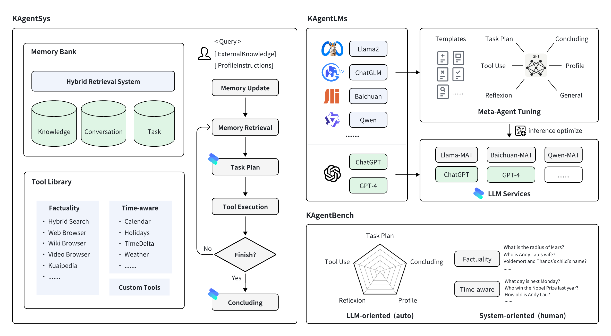

<p align="left">
    <a href="README.md">English</a> ｜ 中文 | <a href="README_JA.md">日本語</a>
</p>
<br><br>

<p align="center">
    
<p>
<br>

<p align="center">
      📚 <a href="https://huggingface.co/datasets/kwaikeg/KAgentInstruct">Dataset</a> | 📚 <a href="https://huggingface.co/datasets/kwaikeg/KAgentBench">Benchmark</a> | 🤗 <a href="https://huggingface.co/collections/kwaikeg/kagentlms-6551e685b5ec9f9a077d42ef">Models</a> | 📑 <a href="http://arxiv.org/abs/2312.04889">Paper</a>
<br>


KwaiAgents 是[快手快知团队](https://github.com/KwaiKEG)开源的一整套Agent系列工作。开源的内容包括：
1. **KAgentSys-Lite**：论文中KAgentSys的轻量版系统，其保留了部分原系统的功能。与功能齐全的系统相比，KAgentSys-Lite（1）缺少部分工具；（2）缺乏记忆机制；（3）性能稍有降低；（4）不同的代码库，Lite版本基于开源项目如<a href='https://github.com/yoheinakajima/babyagi'>BabyAGI</a>和<a href='https://github.com/Significant-Gravitas/AutoGPT'>Auto-GPT</a>。尽管有这些变更，KAgentSys-Lite在众多开源Agent系统中仍具有较好的性能。
2. **KAgentLMs**：经过论文中提出的Meta-agent tuning过后，具有Agents的规划、反思、工具使用等能力的系列大模型。
3. **KAgentInstruct**：超过20w（部分人工编辑）的Agent相关的指令微调数据。
4. **KAgentBench**：超过3k条经人工编辑的自动化评测Agent能力数据，能力评测维度包含规划、工具使用、反思、总结、人设指令等。

<br>
<table align='center'>
    <tr>
        <td align='center'><b>类别</b></td>
        <td align='center'><b>模型</b></td>
        <td align='center'><b>训练数据</b></td>
        <td align='center'><b>评测数据</b></td>
    </tr>
    <tr>
        <td>Qwen</td>
        <td>
            <a href="https://huggingface.co/kwaikeg/kagentlms_qwen_7b_mat">Qwen-7B-MAT</a> <br> 
            <a href="https://huggingface.co/kwaikeg/kagentlms_qwen_14b_mat">Qwen-14B-MAT</a> <br>
            <a href="https://huggingface.co/kwaikeg/kagentlms_qwen_7b_mat_gguf">Qwen-7B-MAT-cpp</a> <br>
            <a href="https://huggingface.co/kwaikeg/kagentlms_qwen1.5_14b_mat">Qwen1.5-14B-MAT</a>
        </td>
        <td align="center" rowspan="2"><a href="https://huggingface.co/datasets/kwaikeg/KAgentInstruct">KAgentInstruct</a></td>
        <td align="center" rowspan="2"><a href="https://huggingface.co/datasets/kwaikeg/KAgentBench">KAgentBench</a></td>
    </tr>
    <tr>
        <td>Baichuan</td>
        <td><a href="https://huggingface.co/kwaikeg/kagentlms_baichuan2_13b_mat">Baichuan2-13B-MAT</a></td>
    </tr>
</table>


<br>

<p align="center">
    
<p>

## 动态
* 2024.4.19 - Qwen1.5-14B-MAT模型[[link]](https://huggingface.co/kwaikeg/kagentlms_qwen1.5_14b_mat) 公开.
* 2024.4.9 - Benchmark结果更新.
* 2024.1.29 - Qwen-14B-MAT模型 [[link]](https://huggingface.co/kwaikeg/kagentlms_qwen_14b_mat) 公开.
* 2023.1.5 - 训练数据 [[link]](https://huggingface.co/datasets/kwaikeg/KAgentInstruct) 公开.
* 2023.12.27 - 🔥🔥🔥 KwaiAgents 被国内外多个媒体报道[[机器之心]](https://mp.weixin.qq.com/s/QhZIFL1GHH90z98gnk194g) [[Medium]](https://medium.com/@myscarletpan/can-7b-models-now-master-ai-agents-a-look-at-kwais-recent-llm-open-source-release-8b9e84647412) [[InfoQ]](https://www.infoq.cn/article/xHGJwG3b8hXSdaP4m6r0)等.
* 2023.12.13 - Benchmark和评测脚本 [[link]](https://huggingface.co/datasets/kwaikeg/KAgentBench) 公开.
* 2023.12.08 - 技术报告 [[link]](https://arxiv.org/abs/2312.04889) 公开.
* 2023.11.17 - 项目公开.

## 评测表现
1. KAgentLMs在Benchmark上的表现

|                | Scale | Planning | Tool-use | Reflection | Concluding | Profile | Overall Score |
|----------------|-------|----------|----------|------------|------------|---------|---------------|
| GPT-3.5-turbo  |   -   |  18.55   |  26.26   |    8.06    |   37.26    |  35.42  |     25.63     |
| Llama2         |  13B  |   0.15   |   0.44   |    0.14    |   16.60    |  17.73  |      5.30     |
| ChatGLM3       |  6B   |   7.87   |  11.84   |    7.52    |   30.01    |  30.14  |     15.88     |
| Qwen           |  7B   |  13.34   |  18.00   |    7.91    |   36.24    |  34.99  |     21.17     |
| Baichuan2      |  13B  |   6.70   |  16.10   |    6.76    |   24.97    |  19.08  |     14.89     |
| ToolLlama      |  7B   |   0.20   |   4.83   |    1.06    |   15.62    |  10.66  |      6.04     |
| AgentLM        |  13B  |   0.17   |   0.15   |    0.05    |   16.30    |  15.22  |      4.88     |
| Qwen-MAT       |  7B   |  31.64   |  43.30   |   33.34    |   44.85    |  44.78  |     39.85     |
| Baichuan2-MAT  |  13B  |  37.27   |  52.97   |   37.00    |   48.01    |  41.83  |     45.34     |
| Qwen-MAT       |  14B  |  43.17   |  63.78   |   32.14    |   45.47    |  45.22  |     49.94     |
| Qwen1.5-MAT    |  14B  |  42.42   |  64.62   |   30.58    |   46.51    |  45.95  |     50.18     |


2. KAgentSys在人工评测上的表现 （百分号前的表示通过率，括号后表示平均分）

|                 | Scale   | NoAgent         | ReACT          | Auto-GPT        | KAgentSys       |
|-----------------|---------|-----------------|----------------|-----------------|-----------------|
| GPT-4           | -       | 57.21% (3.42)    | 68.66% (3.88)   | 79.60% (4.27)    | 83.58% (4.47)    |
| GPT-3.5-turbo   | -       | 47.26% (3.08)    | 54.23% (3.33)   | 61.74% (3.53)    | 64.18% (3.69)    |
| Qwen            | 7B      | 52.74% (3.23)    | 51.74% (3.20)   | 50.25% (3.11)    | 54.23% (3.27)    |
| Baichuan2       | 13B     | 54.23% (3.31)    | 55.72% (3.36)   | 57.21% (3.37)    | 58.71% (3.54)    |
| Qwen-MAT        | 7B      | -                | 58.71% (3.53)   | 65.67% (3.77)    | 67.66% (3.87)    |
| Baichuan2-MAT   | 13B     | -                | 61.19% (3.60)   | 66.67% (3.86)    | 74.13% (4.11)    |

## 使用指南

### AgentLMs 系列模型使用
#### 在GPU上用vLLM部署
我们建议用[vLLM](https://github.com/vllm-project/vllm)和[FastChat](https://github.com/lm-sys/FastChat)来部署模型推理服务，首先需要安装对应的包(详细使用请参考两个项目对应文档)：
1. 对于 Qwen-7B-MAT，按如下方法安装
```bash
pip install vllm
pip install "fschat[model_worker,webui]"
```
1. 对于 Baichuan-13B-MAT，按如下方法安装
```bash
pip install "fschat[model_worker,webui]"
pip install vllm==0.2.0
pip install transformers==4.33.2
```

为了能够部署KAgentLMs系列模型，首先需要在一个终端开启controler
```bash
python -m fastchat.serve.controller
```
然后，再在另一个终端开启单卡模型推理服务部署
```bash
python -m fastchat.serve.vllm_worker --model-path $model_path --trust-remote-code
```
其中`$model_path`为从huggingface中下载的模型本地路径，如果显示GPU不支持Bfloat16，可以再命令行后再加个`--dtype half`。
然后，在第三个终端上开启REST API服务器
```bash
python -m fastchat.serve.openai_api_server --host localhost --port 8888
```

最后你就可以用curl命令对应OpenAI调用格式进行模型调用啦，参考示例：
```bash
curl http://localhost:8888/v1/chat/completions \
-H "Content-Type: application/json" \
-d '{"model": "kagentlms_qwen_7b_mat", "messages": [{"role": "user", "content": "刘德华是谁"}]}'
```
这里 `kagentlms_qwen_7b_mat` 要改成你部署的模型。

#### 在CPU上用[Lamma.cpp](https://github.com/ggerganov/llama.cpp)部署
llama-cpp-python 提供了类似OpenAI的API Web接口，我们可以按如下方法安装和部署。转换后的模型可以在[kwaikeg/kagentlms_qwen_7b_mat_gguf](https://huggingface.co/kwaikeg/kagentlms_qwen_7b_mat_gguf)上找到。
```bash
pip install "llama-cpp-python[server]"
python3 -m llama_cpp.server --model kagentlms_qwen_7b_mat_gguf/ggml-model-q4_0.gguf --chat_format chatml --port 8888
```

最后你就可以用curl命令对应OpenAI调用格式进行模型调用啦，参考示例：
```bash
curl http://localhost:8888/v1/chat/completions \
-H "Content-Type: application/json" \
-d '{"messages": [{"role": "user", "content": "刘德华是谁"}]}'
```

### KAgentSys-Lite 快速使用
下载并安装环境包，建议Python>=3.10
```bash
git clone git@github.com:KwaiKEG/KwaiAgents.git
cd KwaiAgents
python setup.py develop
```

1. **ChatGPT调用**
声明一些环境变量
```
export OPENAI_API_KEY=sk-xxxxx
export WEATHER_API_KEY=xxxxxx
```

其中WEATHER_API_KEY不是必须，但问到天气相关的问题时需要进行配置，APIKEY可以从[这个网站](https://www.weatherapi.com/)中获取（本地模型调用同）。

```bash
kagentsys --query="刘德华老婆是谁？" --llm_name="gpt-3.5-turbo" --lang="zh"
```

1. **本地模型调用**
> 调用本地模型需要参考上一章部署对应模型服务
```bash
kagentsys --query="刘德华老婆是谁？" --llm_name="kagentlms_qwen_7b_mat" \
--use_local_llm --local_llm_host="localhost" --local_llm_port=8888 --lang="zh"
```

下面是完整的命令行参数

| 参数名 | 类型 | 默认值 | 描述 |
| ----- | ---- | ------ | --- |
| --id | str | test | 对话的ID |
| --query | str |  | 用户查询问题 |
| --history | str | [] | 对话历史 |
| --llm_name | str | gpt-3.5-turbo | LLM的名称 |
| --use_local_llm | str | False | 是否使用本地LLM |
| --local_llm_host | str | localhost | 本地LLM部署的IP |
| --local_llm_port | int | 8888 | 本地LLM部署的端口 |
| --tool_names | str | ["auto"] | 使用工具的列表，可选有 web_search,browse_website,get_weather_info,get_calendar_info,time_delta,get_solar_terms_info |
| --max_iter_num | int | 1 | agent迭代次数 |
| --agent_name | str |  | agent名称 |
| --agent_bio | str |  | agent简介，简短的描述 |
| --agent_instructions | str | | agent的指导原则，描述agent如何思考、行动、或交流 |
| --external_knowledge | str |  | 外部知识链接 |
| --lang | str | en | 系统的语言，可选（英语/中文） |
| --max_tokens_num | int | 4096 | Prompt截断最大长度 |

**提示**：
1. 如果需要用到 browse_website 工具，需要在服务器上配置[chromedriver](https://chromedriver.chromium.org/getting-started)
2. 如果多次显示搜索失败，可能是网络无法访问duckduckgo_search，可以通过设置`http_proxy`解决

#### 使用自定义工具
自定义工具使用可参考这个例子 <a href="examples/custom_tool_example.py">examples/custom_tool_example.py</a> 

### KAgentBench效果评估
仅需两行代码就可以:
```bash
cd benchmark
python infer_qwen.py qwen_benchmark_res.jsonl
python benchmark_eval.py ./benchmark_eval.jsonl ./qwen_benchmark_res.jsonl
```
上面的命令会输出以下结果
```
plan : 31.64, tooluse : 43.30, reflextion : 33.34, conclusion : 44.85, profile : 44.78, overall : 39.85
```
更多细节请参考 <a href="benchmark/">benchmark/</a> 


## Citation
```
@article{pan2023kwaiagents,
  author    = {Haojie Pan and
               Zepeng Zhai and
               Hao Yuan and
               Yaojia Lv and
               Ruiji Fu and
               Ming Liu and
               Zhongyuan Wang and
               Bing Qin
               },
  title     = {KwaiAgents: Generalized Information-seeking Agent System with Large Language Models},
  journal   = {CoRR},
  volume    = {abs/2312.04889},
  year      = {2023}
}
```
